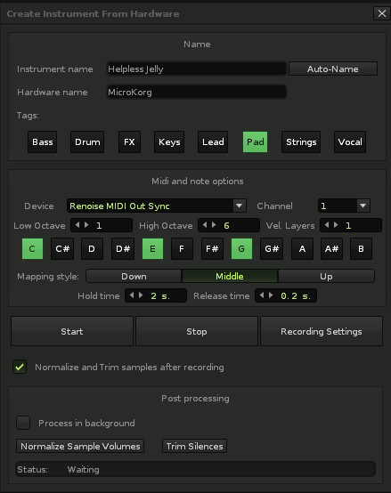

# renoise-hardware-sampler
Automated creation of instruments based on recordings from a hardware device for Renoise

---

## How To

### Building

Run `./package.sh` to create the .xrnx file.

You can also download the latest .xrnx in the releases section.

### Installation

Drag and drop `hack.dpp.hwsampler.xrnx` onto an active Renoise window.

### Overview

The general idea of this tool is to automate the process of recording played notes from your hardware, trimming silence, normalizing volume, and mapping to key zones. The buttons you see when you open the menu change various things about how this is done.

### Usage

To use the tool, right click on the waveform editor and choose "Record Samples from MIDI Hardware".

The buttons have the following functions:

#### Start, Stop, Recording Settings

##### Start

Starts the recording process.

##### Stop

Stops the recording process.

##### Recording Settings

Opens the Renoise sample recording window. **You must change the settings in this window to your liking manually**, although default usually works just fine too.

This is a good time to make sure that Renoise can hear your hardware. Play a note and the indicator at the top of the sample recorder window should react to the audio.

#### Midi and note options

In this section you configure your midi device and decide which notes to actually sample.

##### Midi Device

Midi device to send note commands to.

##### Low Octave

The lowest octave to sample (inclusive). The octave settings correspond to the octave numbers in Renoise.

##### High Octave

The highest octave to sample (inclusive).

##### Notes Matrix

Select the notes you would like to sample in each of the selected octaves by clicking the note buttons. Dark gray means the note won't be sampled, and light gray means it will be sampled.

##### Mapping Style

This setting decides how samples will be mapped to keyzones. Specifically, it decides in which direction the keyzone will grow from the base note to make up for samples that are missing.

The lowest sample will always be mapped starting at C0, and the highest ending at B9.

###### Up

The key zone starts at the base note and extends upwards in pitch to the next note.

###### Down

Like up, but instead of extending to a higher note, the key zone is extended downward to a lower note.

###### Middle

The keyzone is extended in both directions. Any note that doesn't have a direct mapping to a sample will be mapped to the one closest in pitch.

##### Hold Time

The amount of time in seconds that the recorded note will be held down.

##### Release Time

The amount of time to wait, after releasing the note, to stop recording the sample.

#### Post processing

These are post-processing options. Click these buttons after the recording process is finished. It is also possible to use these on samples recorded via other means than this tool -- the buttons simply process all current samples.

##### Process in background

When checked, the post processing options will use less CPU and process in the background, allowing you to close the tool window and use Renoise elsewhere. 

When not checked, more CPU is allocated to the post processing functions and they will finish more quickly. Closing the window will stop the processes in this case.

##### Normalize Sample Volumes

Boost sample volume as much as possible, while maintaining the current relative volume levels between samples. In other words, find the loudest sample, maximize its volume, and increase the volume of all other samples by the same amount.

##### Trim Silences

For each sample, remove any leading silence.

#### Instrument Name

Sets the instrument name after samples are recorded.

## Issues and Pull Requests

If you find a bug or would like an additional feature, feel free to open an issue or create a pull request.
